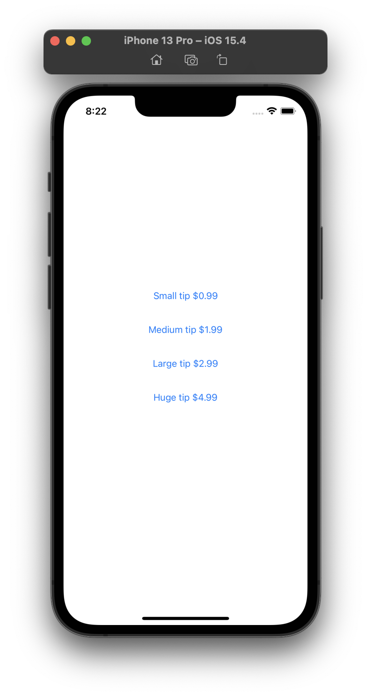
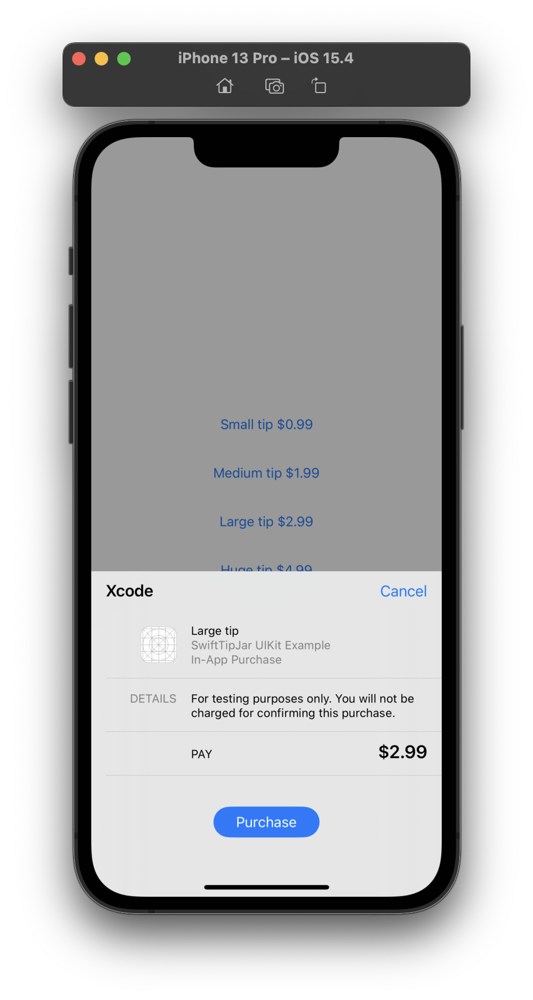
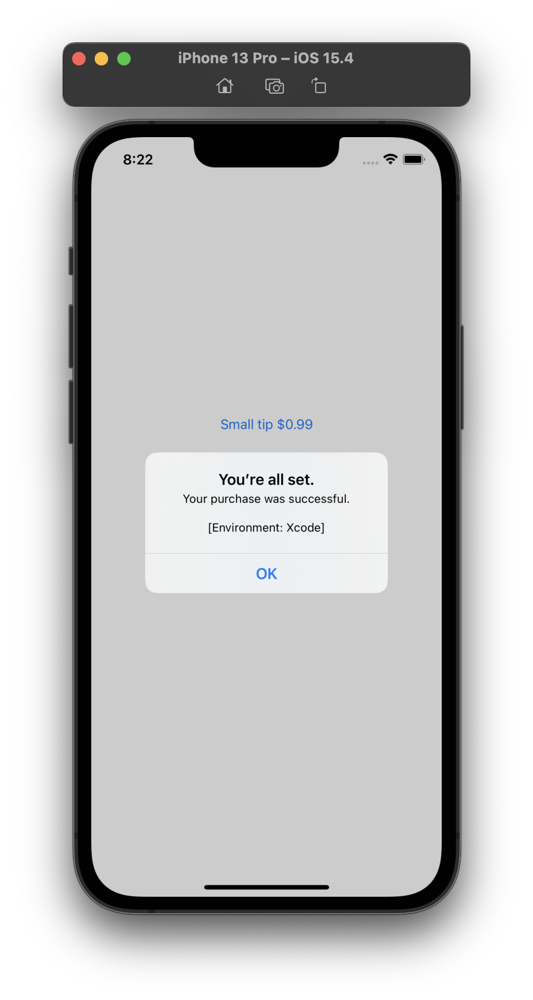
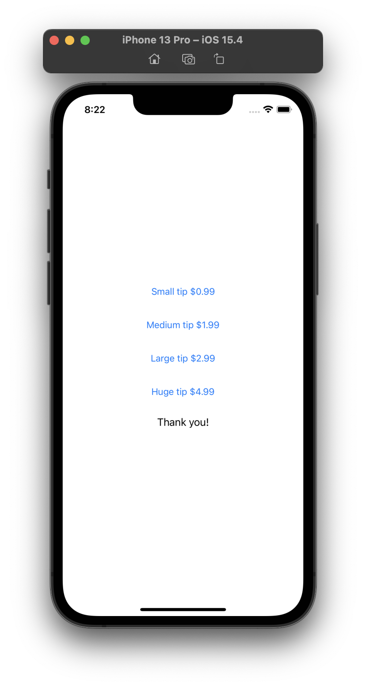

# UIKit tip jar example, using SwiftTipJar

This **UIKit** sample code demonstrates ease of use for [SwiftTipJar](https://github.com/dkasaj/SwiftTipJar) - an open source package. 

There is also [SwiftUI sample code](https://github.com/dkasaj/SwiftTipJar-SwiftUI-Example) (same functionality). 

Tip jars on Apple platforms are a concept of letting users make in-app purchases to show appreciation for the app/developer. These don't actually unlock any additional features.

## Demo app screenshots
| Choice of tips | System UI for purchasing | Successful purchase | Thank you message |
| - | - | - | - |
 |  |  | 

## Usage
1. Init TipJar with identifiers for In-App Purchases you wish to offer
2. Make TipJar observe StoreKit's payment queue
3. Set up code blocks to run after products information is received - from Xcode (when using StoreKit Configuration file) or from App Store Connect over the network - and after a transaction succeeds or fails.
4. Request the products information 

```swift
// #1
let tipJar = SwiftTipJar(tipsIdentifiers: Set(["com.test.smallTip", "com.test.mediumTip", "com.test.largeTip", "com.test.hugeTip"]))

override func viewDidLoad() {
  super.viewDidLoad()
  // #2
  tipJar.startObservingPaymentQueue()

  // #3
  tipJar.productsReceivedBlock = setupButtons
  tipJar.transactionSuccessfulBlock = showThankYou

  // #4
  tipJar.productsRequest?.start()
}
```

5. As soon as tipJar finds out about the products, it runs publishes _tips_, an array of Tip objects that supplies you with _displayName_ and _displayPrice_, in local language and currency, and runs _productsReceivedBlock_. Tips array has been sorted by price, ascending. Products that haven't been configured with a name and/or price are simply omitted from this array. 

```swift
@Published public private(set) var tips: [Tip] = []
```

```swift
public final class Tip {
    public var identifier: String = ""
    public var displayName: String = ""
    public var displayPrice: String = ""

    /// TipJar uses this to quickly check if it should include this Tip in its published array.
    var isValid: Bool {
        return !identifier.isEmpty && !displayName.isEmpty && !displayPrice.isEmpty
    }
}
```
6. Assign any code you want to run after a successful purchase to _transactionSuccessfulBlock_, and similarly any code you want to run after a failed purchase (user clicked Cancel instead of Purchase) to _transactionFailedBlock_. 
With tip jars, it's even natural to do nothing if a transaction fails.  
7. Set up button(s) to initiate a purchase to trigger the action _initiatePurchase(productIdentifier:)_ 
```swift
@objc func userDidTapButton(_ sender: UIButton?) {
  guard let identifier = sender?.accessibilityIdentifier else { return }
  tipJar.initiatePurchase(productIdentifier: identifier)
}
```

## Troubleshooting
**Q: I've set up IAPs in a StoreKit Configuration file, but nothing is showing up in the demo app**

A: Edit Scheme > Options, and check that you have the correct StoreKit Configuration selected

**Q: I've set up IAPs in StoreKit Configuration file, some are showing up in demo app, but not all**

A: Check that TipJar's init is called with all relevant identifiers; check identifiers for any spelling errors. Check that you've provided the name and price for every IAP you want to see in the demo app.
